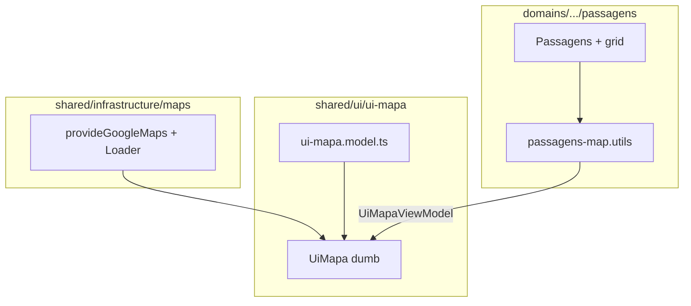

# UiMapa — Model vs componente dumb

Guia para implementar um mapa Google **reutilizável** (dumb component) no projeto Angular 21.

## Estrutura de pastas alvo

```text
shared/
  infrastructure/
    maps/
      google-maps-config.ts
      google-maps-loader.service.ts
  ui/
    ui-mapa/
      ui-mapa.model.ts      ← contrato de dados (só tipos)
      ui-mapa.ts
      ui-mapa.html
      ui-mapa.scss
      index.ts
  utils/                    ← mappers puros (opcional, por domínio)

domains/
  relatorios/
    features/
      passagens/
        passagens-map.utils.ts   ← monta UiMapaViewModel (smart)
```

**Separação:** o **model** diz *o quê* desenhar; o **dumb** diz *como* desenhar; o **domínio** monta o view model a partir da regra de negócio (grid, checkbox, ordem da lista).

---

## Parte 1 — O que DEVE ter no `ui-mapa.model.ts`

Arquivo: `shared/ui/ui-mapa/ui-mapa.model.ts`

Apenas **TypeScript** (interfaces/types). Sem `@angular/core`, sem serviços, sem `PassagemPosition`, sem API key.

### `MapLatLng`

Coordenada genérica:

```typescript
export interface MapLatLng {
  lat: number;
  lng: number;
}
```

### `MapMarkerKind`

```typescript
export type MapMarkerKind = 'start' | 'end' | 'waypoint';
```

### `MapMarker`

Ponto que o componente desenha:

```typescript
export interface MapMarker {
  id: string;
  position: MapLatLng;
  title?: string;
  kind: MapMarkerKind;
}
```

| Campo | Função |
|-------|--------|
| `id` | Track estável no `@for` |
| `position` | Onde desenhar |
| `title` | Tooltip / acessibilidade |
| `kind` | Estilo e regra de visibilidade (waypoint só com zoom) |

**Regra:** o model **não** decide qual linha da grid é início/fim. O componente pai já envia `kind` correto.

### `MapPolyline`

Trecho de linha:

```typescript
export interface MapPolyline {
  id: string;
  path: MapLatLng[];
  options?: google.maps.PolylineOptions;
}
```

| Campo | Função |
|-------|--------|
| `path` | Mínimo 2 pontos para desenhar |
| `options` | Cor, espessura etc. (opcional) |

**Regra:** o model **não** calcula “trecho azul vs vermelho”. O pai envia N polylines prontas.

### `UiMapaViewModel`

Objeto único passado ao mapa:

```typescript
export interface UiMapaViewModel {
  markers: MapMarker[];
  polylines: MapPolyline[];
  /** Usado apenas para fitBounds; pode repetir coordenadas dos markers. */
  boundsPath: MapLatLng[];
}
```

### O que **NÃO** entra no model

- `PassagemPosition`, checkbox, ag-grid, mock de passagens
- `loading` / `errorMessage` (estado de infra/UI, não geometria)
- Funções `buildXFromY` (ficam no domínio, ex.: `passagens-map.utils.ts`)
- `GoogleMapsLoaderService`, `provideGoogleMaps`

---

## Parte 2 — O que DEVE ter no componente dumb `UiMapa`

Arquivos: `shared/ui/ui-mapa/ui-mapa.ts`, `.html`, `.scss`, `index.ts`

**Responsabilidade:** receber dados prontos e desenhar. Não busca API, não filtra grid, não parseia lat/lng de string de backend.

### Inputs

| Input | Tipo | Obrigatório | Função |
|-------|------|-------------|--------|
| `viewModel` | `UiMapaViewModel \| null` | sim | Marcadores, linhas e bounds |
| `loading` | `boolean` | não | Placeholder “Carregando mapa…” |
| `errorMessage` | `string \| null` | não | Placeholder de erro |
| `mapId` | `string` | não | Map ID do Google (Advanced Markers) |
| `waypointZoomThreshold` | `number` | não | Zoom mínimo para waypoints (default **14**) |
| `endpointIcon` | `string` | não | Ícone Material em start/end (default **`home`**) |
| `fitBoundsPadding` | `number` | não | Padding do fitBounds (default **40**) |

Preferir **um** `viewModel` em vez de vários inputs (`startConnector`, `middlePath`, etc.).

### Outputs

| Output | Payload | Quando |
|--------|---------|--------|
| `mapReady` | `google.maps.Map` | Mapa inicializado |
| `zoomChange` | `number` | Zoom alterado (usuário ou fitBounds) |

### Comportamento interno (lógica de UI permitida)

1. **Estados do template**
   - `loading` → placeholder loading
   - `errorMessage` → placeholder erro
   - caso contrário → `<google-map>`

2. **Polylines**
   - Iterar `viewModel()?.polylines`
   - `<map-polyline [path]="..." [options]="..." />`

3. **Marcadores**
   - `start` / `end` → sempre visíveis; ícone Material (`endpointIcon`); start verde, end vermelho
   - `waypoint` → visíveis só se `currentZoom >= waypointZoomThreshold`; ao zoom out, ocultar

4. **Zoom**
   - Listener `zoom_changed` no mapa
   - Signal `currentZoom`
   - Filtrar waypoints pelo threshold (única regra “inteligente” do dumb)

5. **Enquadramento (`fitBounds`)**
   - Quando `viewModel.boundsPath` mudar:
     - 1 ponto → `setCenter` + zoom ~14
     - ≥2 pontos → `fitBounds` com padding configurável

6. **Centro/zoom inicial**
   - Se o pai não passar center/zoom, usar `boundsPath[0]` ou default

### Template (estrutura esperada)

```html
@switch (estado) {
  @case ('loading') {
    <div class="ui-mapa__placeholder" role="status">Carregando mapa…</div>
  }
  @case ('error') {
    <div class="ui-mapa__placeholder ui-mapa__placeholder--error" role="alert">
      {{ errorMessage() }}
    </div>
  }
  @case ('ready') {
    <google-map (mapInitialized)="onMapInitialized($event)">
      @for (polyline of viewModel().polylines; track polyline.id) {
        <map-polyline [path]="polyline.path" [options]="polyline.options" />
      }
      @for (marker of endpointMarkers(); track marker.id) {
        <map-advanced-marker [position]="marker.position" [title]="marker.title ?? ''">
          <div class="ui-mapa__endpoint" [class.ui-mapa__endpoint--start]="marker.kind === 'start'">
            <mat-icon>{{ endpointIcon() }}</mat-icon>
          </div>
        </map-advanced-marker>
      }
      @for (marker of visibleWaypoints(); track marker.id) {
        <map-advanced-marker [position]="marker.position" [title]="marker.title ?? ''">
          <div class="ui-mapa__waypoint"></div>
        </map-advanced-marker>
      }
    </google-map>
  }
}
```

### Estilos (`ui-mapa.scss`)

- `:host { display: block; width: 100%; height: 100%; min-height: 240px; }`
- `.ui-mapa__endpoint` — círculo + ícone (start verde, end vermelho)
- `.ui-mapa__waypoint` — bolinha pequena vermelha
- Placeholders loading/erro

### O que **NÃO** ter no dumb

- `inject(GoogleMapsLoaderService)` (loader na infra ou wrapper pai)
- `buildMapRouteFromPositions`, mock, checkbox, grid
- Inputs de domínio (`PassagemPosition[]`)
- Regra “último da lista é fim” (fica no mapper da feature)

---

## Parte 3 — Infraestrutura (fora do model e do dumb)

### `shared/infrastructure/maps/google-maps-config.ts`

- `GOOGLE_MAPS_CONFIG` (InjectionToken)
- `provideGoogleMaps(config)` com `apiKey`, `libraries`, `language`, `region`

### `shared/infrastructure/maps/google-maps-loader.service.ts`

- `setOptions()` + `importLibrary('maps')`
- Cache de Promise (carregar API uma vez)

### `app.config.ts`

```typescript
provideGoogleMaps({
  apiKey: '...',
  libraries: ['marker'],
  language: 'pt-BR',
  region: 'BR',
}),
```

Opcional: wrapper que chama `loader.load()` antes de renderizar `<app-ui-mapa>`.

---

## Parte 4 — Uso na feature (smart — Passagens)

O domínio monta o `UiMapaViewModel`. Exemplo:

```typescript
const viewModel: UiMapaViewModel = {
  markers: [
    { id: 'start', kind: 'start', position: { lat: -23.561, lng: -46.655 }, title: 'Partida' },
    { id: 'wp-1', kind: 'waypoint', position: { lat: -23.565, lng: -46.652 }, title: '10:05' },
    { id: 'end', kind: 'end', position: { lat: -23.587, lng: -46.657 }, title: 'Chegada' },
  ],
  polylines: [
    { id: 'connector-start', path: [...], options: { strokeColor: '#1a73e8', strokeWeight: 4 } },
    { id: 'middle', path: [...], options: { strokeColor: '#d93025', strokeWeight: 4 } },
    { id: 'connector-end', path: [...], options: { strokeColor: '#1a73e8', strokeWeight: 4 } },
  ],
  boundsPath: [ /* todos os pontos para enquadrar */ ],
};
```

```html
<app-ui-mapa
  [viewModel]="mapView()"
  [loading]="mapsLoading()"
  [errorMessage]="mapsError()"
/>
```

### Responsabilidades na feature Passagens

| O quê | Onde |
|-------|------|
| Checkbox, selecionar todos, ordem da lista | `ui-filter-table` + `passagens.ts` |
| `PassagemPosition` → `UiMapaViewModel` | `passagens-map.utils.ts` |
| Primeiro da lista = `start`, último = `end` | `passagens-map.utils.ts` |
| Cores dos trechos (azul/vermelho) | `passagens-map.utils.ts` (nas `options` de cada polyline) |

---

## Diagrama de camadas



---

## Ordem de implementação sugerida

1. `ui-mapa.model.ts` — tipos
2. Infra Maps (config + loader) + `app.config`
3. `UiMapa` mínimo: loading / error / mapa vazio
4. Polylines a partir de `viewModel.polylines`
5. Marcadores start/end
6. Waypoints condicionados ao zoom
7. `fitBounds` em `boundsPath`
8. Feature Passagens: mapper + integração com checkbox

---

## Critérios de aceite

- [ ] `ui-mapa.model.ts` exporta só tipos; sem imports de `@angular/core`
- [ ] `UiMapa` aceita `viewModel` e renderiza markers + polylines
- [ ] Waypoints aparecem/desaparecem conforme zoom (threshold configurável)
- [ ] Start/end sempre visíveis com ícone configurável
- [ ] Componente compila sem referência a `relatorios` ou `passagens`
- [ ] `index.ts` reexporta model + componente
- [ ] Loader e API key ficam em `shared/infrastructure/maps`

---

## Stack

- Angular 21 standalone, `ChangeDetectionStrategy.OnPush`
- Signals: `input()`, `output()`, `computed()`, `signal()`
- `@angular/google-maps` (`GoogleMap`, `MapAdvancedMarker`, `MapPolyline`)
- `@angular/material/icon` para marcadores de extremidade
- Textos de UI em português

---

## Prompt curto (copiar para o Agent)

> Implemente `shared/ui/ui-mapa/` (model + dumb) e `shared/infrastructure/maps/` conforme `docs/ui-mapa-dumb-component.md`. O dumb recebe `viewModel: UiMapaViewModel`, inputs `loading`/`errorMessage`, waypoints por zoom ≥14, start/end com `home`. Sem lógica de Passagens no UiMapa. Registrar `provideGoogleMaps` no `app.config`.
