# Diretrizes desenvolvimento frontend — Angular moderno

## Introdução

Este documento define como organizar, nomear, testar e evoluir o código frontend em projetos Angular sem Nx, com alvo no Angular 21 e versões posteriores. O objetivo é eliminar decisões repetidas no dia a dia, reduzir o acoplamento entre partes do sistema e dar ao time uma referência única.

A arquitetura se organiza em dois eixos. O eixo vertical divide o sistema em **domínios de negócio** isolados. O eixo horizontal divide cada domínio em quatro **camadas técnicas**: `features/` (orquestra casos de uso), `ui/` (componentes visuais reutilizáveis), `data-access/` (acesso a dados e estado) e `utils/` (utilitários técnicos). O cruzamento desses eixos forma a matriz de arquitetura, ponto de partida de qualquer decisão estrutural.

Seis decisões sustentam o guia:

- **Repository Pattern** — uma `abstract class` é o contrato entre a feature e o acesso a dados. Permite trocar a implementação por um mock nos testes sem subir HTTP.
- **Observable em `data-access/`, Signal em features** — Observables ficam confinados à camada de dados; `toSignal()` é a única fronteira de conversão. O template nunca vê Observable.
- **Adapter Pattern** — toda lib de terceiro é encapsulada por uma interface própria. Trocar a lib muda apenas o adapter.
- **Information hiding via `internal/`** — código privado fica em `internal/`; sem barrels (`index.ts`). O Sheriff garante que ninguém importe o que é privado.
- **Nomenclatura de métodos por intenção** — verbos padronizados (`findAll`, `create`, `load`, `reset`) tornam o código legível sem ler a implementação.
- **Enforcement automatizado** — Sheriff, ESLint e budgets de bundle são gates do CI. Regras para governanca e manutenabilidade.

O guia tem 14 seções sobre a arquitetura e anti-padrões. Cada regra é marcada como **MUST** (obrigatória, CI bloqueia), **SHOULD** (recomendada, desvio documentado no PR) ou **MAY** (opcional). A versão operacional para desenvolvimento com IA estara no `CLAUDE.md`.

---

## 0. Como usar este guia

Este documento é a fonte da verdade para decisões de arquitetura. A versão enxuta para agentes de IA estára no `CLAUDE.md` na raiz do repositório.

| Nível      | Significado                                                     |
| ---------- | --------------------------------------------------------------- |
| **MUST**   | Obrigatório. O CI bloqueia o merge se violado.                  |
| **SHOULD** | Padrão recomendado. Desvie com justificativa documentada no PR. |
| **MAY**    | Opcional. Escolha conforme o contexto.                          |

**Princípio guia:** Comece com o código próximo de onde é usado; generalize só quando uma segunda parte do sistema precisar dele.

---

## 1. Visão geral da arquitetura

### 1.1 Objetivos

A primeira pergunta natural é: por que toda essa estrutura? Por que não simplesmente criar componentes e telas conforme a necessidade for surgindo?

A resposta está no que acontece quando um projeto cresce. Um componente criado para uma tela específica começa a ser reutilizado em outras, carregando consigo lógicas que não pertencem àquele contexto.

Esta arquitetura existe para evitar exatamente isso. Ela foi pensada para que o projeto possa crescer em funcionalidades, em tamanho de time e em complexidade de negócio.

Os principais objetivos são:

- **Modularidade** — o sistema é dividido em partes pequenas e substituíveis.
- **Isolamento de domínios** — uma mudança no Domínio A não quebra o Domínio B.
- **Testabilidade** — cada parte pode ser testada isoladamente.
- **Baixo acoplamento e alta coesão** — o que muda junto fica junto; o que é independente não se enxerga.
- **Carga cognitiva reduzida** — trabalhar em uma área de forma individualizada.

### 1.2 Princípios gerais

- **SRP** — cada arquivo e classe tem uma única responsabilidade.
- **Dependências unidirecionais** — fluem em uma direção: camadas de cima dependem das de baixo, nunca o contrário. Isso elimina ciclos.
- **Componentização** — a UI é feita de peças pequenas e combináveis. Componentes apresentacionais não conhecem regra de negócio.
- **Information hiding** — cada módulo expõe uma API pública mínima e esconde o resto.

### 1.3 Modelo mental: a matriz de arquitetura

A arquitetura cruza dois eixos ortogonais: verticais (domínios de negócio) e camadas (tipos de módulo).

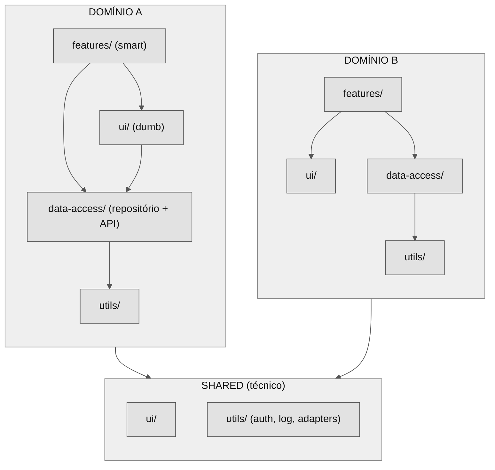

| Camada           | Responsabilidade                                                                     | Regra de negócio? | Backend?           |
| ---------------- | ------------------------------------------------------------------------------------ | ----------------- | ------------------ |
| **features/**    | Orquestra um caso de uso. Smart components, rotas, composição de estado.             | Sim               | Via `data-access/` |
| **ui/**          | Componentes apresentacionais reutilizáveis. Comunicação só por `input()`/`output()`. | Não               | Não                |
| **data-access/** | Repositório (abstração), implementação de API, modelo de domínio, estado.            | Sim               | Sim                |
| **utils/**       | Funções técnicas genéricas: datas, logging, auth helpers, adapters de libs.          | Não               | Não                |

Duas regras derivam da matriz: (1) um domínio só fala com seus próprios módulos e com `shared`; (2) cada módulo só acessa camadas abaixo.

---

## 2. Estrutura de pastas

### 2.1 Visão geral do workspace

verticais e camadas são representadas por pastas. A estrutura física espelha a matriz de arquitetura. Cada camada é uma pasta-mãe (`features/`, `ui/`, `data-access/`, `utils/`) dentro do domínio.

<pre style="background:#E8E8E8;color:#000000;padding:12px 14px;border:1px solid #BBBBBB;border-radius:4px;font-family:monospace;font-size:0.88em;line-height:1.5;">
src/
├── app/
│   ├── domains/
│   │   ├── domain-a/
│   │   │   ├── features/
│   │   │   │   ├── item-search/
│   │   │   │   │   ├── internal/
│   │   │   │   │   │   └── search-mapper.ts
│   │   │   │   │   ├── item-search.ts
│   │   │   │   │   ├── item-search.html
│   │   │   │   │   ├── item-search.css
│   │   │   │   │   └── item-search.spec.ts
│   │   │   │   └── item-detail/
│   │   │   │       └── item-detail.ts
│   │   │   ├── ui/
│   │   │   │   └── item-card/
│   │   │   │       ├── item-card.ts
│   │   │   │       └── item-card.spec.ts
│   │   │   ├── data-access/
│   │   │   │   └── items/
│   │   │   │       ├── internal/
│   │   │   │       │   ├── http-mapper.ts
│   │   │   │       │   └── item-validation.ts
│   │   │   │       ├── item.ts
│   │   │   │       ├── item-repository.ts
│   │   │   │       └── item-api.ts
│   │   │   └── utils/
│   │   │       └── formatting/
│   │   │           └── date-formatter.ts
│   │   ├── domain-b/
│   │   └── shared/
│   │       ├── ui/
│   │       │   ├── button/
│   │       │   └── modal/
│   │       └── utils/
│   │           ├── auth/
│   │           │   ├── auth-store.ts
│   │           │   ├── auth-interceptor.ts
│   │           │   └── auth-guard.ts
│   │           └── adapters/
│   │               ├── some-adapter.ts
│   │               └── internal/
│   │                   └── some-adapter.ts
│   ├── app.ts
│   ├── app.config.ts
│   └── app.routes.ts
├── main.ts
└── styles.css
</pre>

### 2.2 Pasta de domínios

- Cada domínio é uma subpasta de `src/app/domains/`. **MUST:** o nome é um conceito de negócio, nunca técnico (`components`, `services`).
- Dentro do domínio, as pastas `features/`, `ui/`, `data-access/` e `utils/` agrupam os módulos pela camada. A posição na matriz é legível só pela estrutura de diretórios.

### 2.3 Pasta `shared`

`shared` é um domínio especial para código reutilizável e técnico, sem regra de negócio.

- **Entra:** design system (`ui/`), interceptors genéricos, guards de auth, adapters de libs, helpers de formatação.
- **Não entra:** modelo de domínio, regra de negócio, serviços de contexto específico.

> **Anti-padrão crítico:** `shared` inchado. Se a maior parte do código vira "compartilhado", o acoplamento global volta. `shared` deve ser pequeno.

### 2.4 Information hiding (`internal/`, sem barrel) — MUST

Código privado de um módulo vai em `internal/`. Tudo fora de `internal/` é a API pública. Sem `index.ts`: barrels quebram tree-shaking e lazy loading. O Sheriff (Seção 13) garante que outros módulos não importem de `internal/`.

```
domain-a/data-access/items/
├── internal/
│   ├── http-mapper.ts        # privado — livre para refatorar
│   └── item-validation.ts    # privado
├── item.ts                   # público — é contrato
├── item-repository.ts        # público — é contrato
└── item-api.ts               # público
```

### 2.5 Path mappings — MUST

Importe por path mapping, nunca por caminho relativo profundo.

```jsonc
// tsconfig.json
{
  "compilerOptions": {
    "baseUrl": "./",
    "paths": { "@app/*": ["src/app/domains/*"] }
  }
}
```

```ts
// Errado — frágil, quebra ao mover arquivos
import { ItemRepository } from '../../../data-access/items/item-repository';

// Correto — reflete a posição na matriz
import { ItemRepository } from '@app/domain-a/data-access/items/item-repository';
```

### 2.6 Regras de dependência (boundaries) — MUST

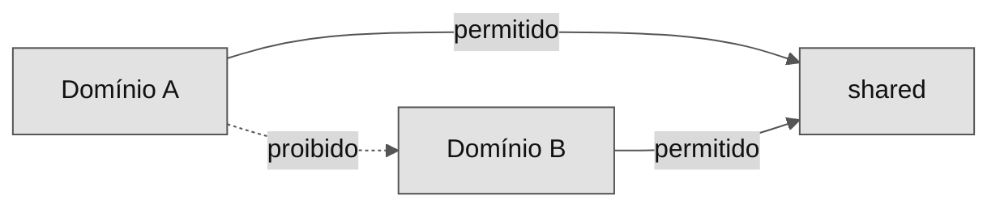

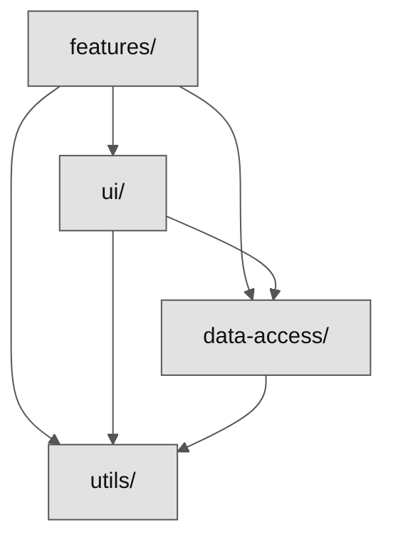

1. **Entre domínios:** só importa do próprio domínio e de `shared`.
2. **Entre camadas:** `features/` → `ui/`, `data-access/`, `utils/`; `ui/` → `data-access/`, `utils/`; `data-access/` → `utils/`; `utils/` → nada.
3. **API pública:** nunca importe de `internal/` de outro módulo.
4. **Sem ciclos** — as regras anteriores tornam ciclos impossíveis por construção.

Comunicação entre domínios é por eventos ou contratos em `shared/`, nunca import direto.

---

## 3. Domínios e módulos de feature

### 3.1 Anatomia de um domínio

Um domínio agrupa casos de uso relacionados sobre o mesmo modelo. Sinais de que algo é um domínio próprio:

- **Linguagem:** o mesmo termo com significado diferente indica contextos distintos.
- **Responsabilidades:** papéis diferentes tendem a domínios diferentes.
- **Eventos pivô:** pontos de virada difíceis de desfazer marcam fronteiras.

> Não existe fronteira perfeita. Decida com o time e refatore se a análise (Seção 13) mostrar acoplamento indevido.

### 3.2 Camadas dentro do domínio

Ao criar código, classifique a camada primeiro (o que isto faz?), depois o domínio (a qual negócio pertence?). A camada define a pasta-mãe; o domínio define onde dentro de `domains/`.

### 3.3 Standalone-first, roteamento e lazy loading — MUST

Componentes são standalone. Não crie `NgModule`. Features são carregadas com lazy loading: cada domínio só é baixado quando a rota é acessada.

```ts
// app.routes.ts
export const routes: Routes = [
  { path: '', pathMatch: 'full', redirectTo: 'domain-a' },
  {
    path: 'domain-a',
    loadChildren: () => import('@app/domain-a/features/item-search/item-search.routes').then((m) => m.itemSearchRoutes),
  },
];

// domain-a/features/item-search/item-search.routes.ts
export const itemSearchRoutes: Routes = [
  {
    path: '',
    providers: [ItemStore, { provide: ItemRepository, useClass: ItemApi }],
    loadComponent: () => import('./item-search').then((m) => m.ItemSearch),
  },
];
```

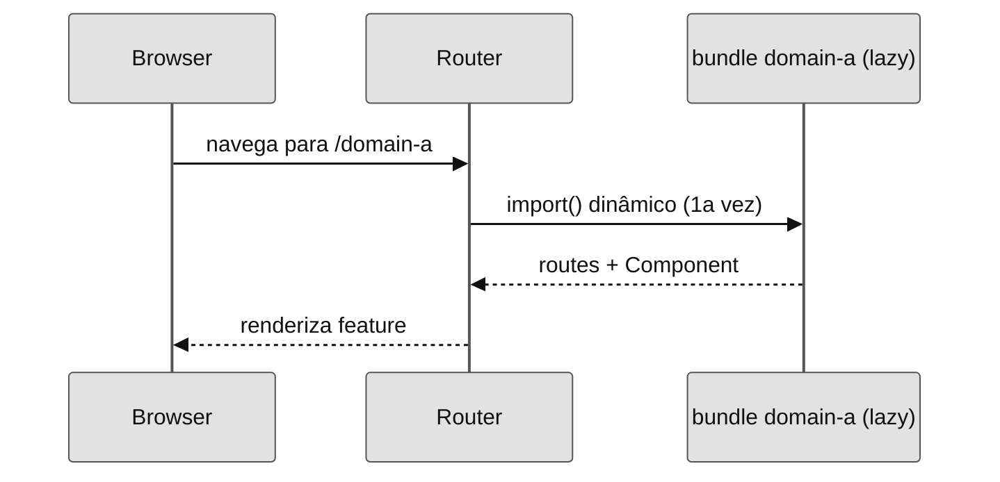

### 3.4 Route-level providers

Serviços e stores que só fazem sentido dentro de uma feature são providos na rota, não em `providedIn: 'root'`. Isso escopa o estado ao tempo de vida da rota e libera memória ao sair.

```ts
{
  path: 'domain-a',
  providers: [ItemStore],   // vive enquanto a rota estiver ativa
  loadChildren: () => import('...').then(m => m.itemSearchRoutes),
}
```

### 3.5 Feature-local vs. promovido

Comece com tudo local à feature. Promova para `ui/` ou `data-access/` do domínio só quando uma segunda feature precisar do mesmo bloco. Promover antes cria abstração especulativa: código "reutilizável" que ninguém reusa, mas que todos pagam para manter.

### 3.6 Limites entre domínios

- **MUST:** proibido import entre domínios (Sheriff reporta no editor e no CI).
- Comunicação entre domínios é por eventos ou contratos em `shared/`.
- Estado contextual mínimo (usuário logado, filtros globais) vive em `shared/utils/`.

---

## 4. Componentes e UI

### 4.1 Smart (container) vs. Dumb (presentational)

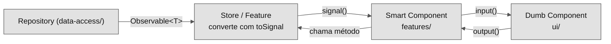

|                          | Smart (features/)   | Dumb (ui/)              |
| ------------------------ | ------------------- | ----------------------- |
| Conhece o caso de uso    | Sim                 | Não                     |
| Acessa store/repositório | Sim                 | Nunca                   |
| Comunicação              | Injeta dependências | Só `input()`/`output()` |
| Reutilizável             | Pouco               | Muito                   |

### 4.2 Componentes reutilizáveis — MUST

Componentes em `ui/` se comunicam apenas por `input()`/`output()`. Não injetam `HttpClient`, store, nem conhecem domínio.

```ts
// shared/ui/item-card/item-card.ts
@Component({
  selector: 'app-item-card',
  changeDetection: ChangeDetectionStrategy.OnPush,
  template: `
    <article>
      <h3>{{ title() }}</h3>
      <p>{{ description() }}</p>
      <button (click)="select.emit()">Selecionar</button>
    </article>
  `,
})
export class ItemCard {
  title = input.required<string>();
  description = input<string>('');
  select = output<void>();
}
```

### 4.3 OnPush — MUST em todos os componentes

`ChangeDetectionStrategy.OnPush` é obrigatório. No Angular 21 zoneless, a detecção não é mais automática via Zone.js. Só Signals + OnPush garantem renderização determinística e mínima: o Angular atualiza apenas as ligações cujo signal dependente mudou.

### 4.4 Template moderno

Use `@if`/`@for`/`@switch`. Não use `*ngIf`/`*ngFor` (legado). Use `@defer` para conteúdo não-crítico ou pesado.

```html
@if (items().length) { @for (item of items(); track item.id) {
<app-item-card [title]="item.title" (select)="onItemSelected(item)" />
} } @else {
<p>Nenhum item encontrado.</p>
} @defer (on viewport) {
<app-item-detail-map [item]="selected()" />
} @placeholder {
<div class="skeleton"></div>
}
```

> O `track` no `@for` é obrigatório. Sem ele, o Angular recria os nós do DOM a cada mudança.

---

## 5. Estado e reatividade

### 5.1 Regra de ouro: Observable na `data-access/`, Signal na feature

Observables ficam confinados à camada `data-access/`. O componente só conhece Signal. `toSignal()` é a fronteira obrigatória de conversão.

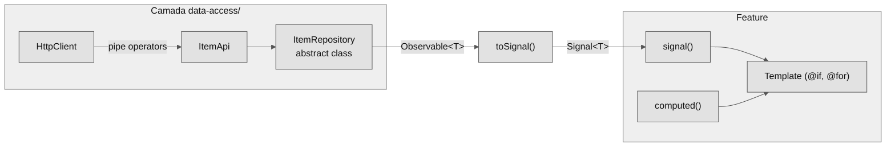

| Use Signals para...                 | Use RxJS/Observable para...                |
| ----------------------------------- | ------------------------------------------ |
| Estado atual, leitura pelo template | Stream de eventos ao longo do tempo        |
| Valores derivados (`computed`)      | Debounce, throttle, retry, combinar fontes |
| Estado de UI (loading, seleção)     | Operações canceláveis (`switchMap`)        |
| Comunicação com o template          | Permanecer na camada `data-access/`        |

### 5.2 Escada de estado

Adote a solução mais simples que resolve o problema. Suba um degrau só quando o atual não bastar.

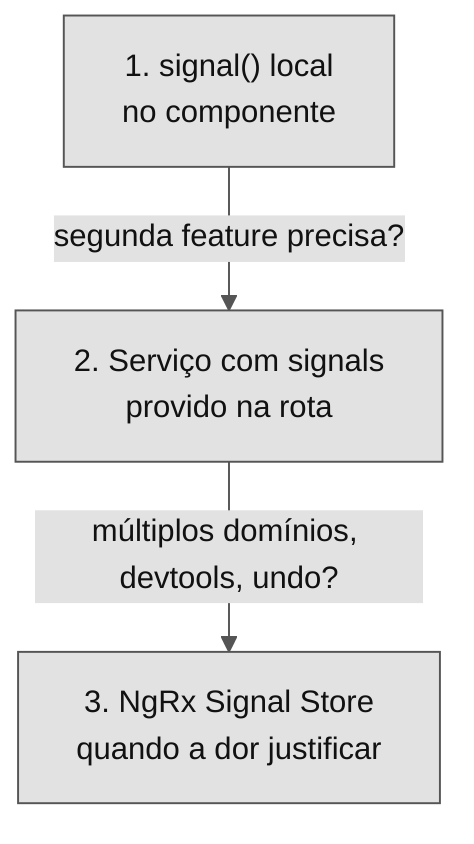

Para times em formação, os degraus 1 e 2 cobrem a maioria dos casos. Um serviço com signals provido na rota já é um store, sem cerimônia e sem biblioteca nova.

```ts
// data-access/items/item-store.ts  — degrau 2: serviço com signals
@Injectable() // sem providedIn — escopo controlado pela rota
export class ItemStore {
  private repo = inject(ItemRepository);

  private _items = signal<Item[]>([]);
  private _loading = signal(false);

  readonly items = this._items.asReadonly();
  readonly loading = this._loading.asReadonly();
  readonly count = computed(() => this._items().length);

  async load(): Promise<void> {
    this._loading.set(true);
    try {
      this._items.set(await firstValueFrom(this.repo.findAll()));
    } finally {
      this._loading.set(false);
    }
  }
}
```

### 5.3 `computed`, `effect` e imutabilidade

- **`computed`** para derivar estado. Memoizado, recalcula só quando uma dependência muda. **MUST:** derivações vão em `computed`, nunca recalculadas à mão.
- **`effect`** apenas para side-effects externos (log, localStorage, libs). **MUST NOT:** usar `effect` para derivar ou setar outro signal; use `computed`.
- **MUST:** trate o estado como imutável. Substitua o valor, não mute no lugar. No zoneless, mutação no lugar pode não atualizar a tela.

```ts
// Errado: mutação no lugar
this._items().push(novoItem);

// Correto: novo array
this._items.update((list) => [...list, novoItem]);
```

---

## 6. Acesso a dados e HTTP

### 6.1 Repository Pattern — a abstração da camada `data-access/` — MUST

A camada `data-access/` de cada domínio expõe um repositório como `abstract class`. A feature injeta o repositório (o contrato), nunca a implementação concreta. A implementação (que faz HTTP) é provida via DI.

Por que `abstract class` e não interface TypeScript? Interfaces somem em runtime e não podem ser usadas como token de injeção sem `InjectionToken` extra. `abstract class` sobrevive ao compilador e funciona direto no DI.

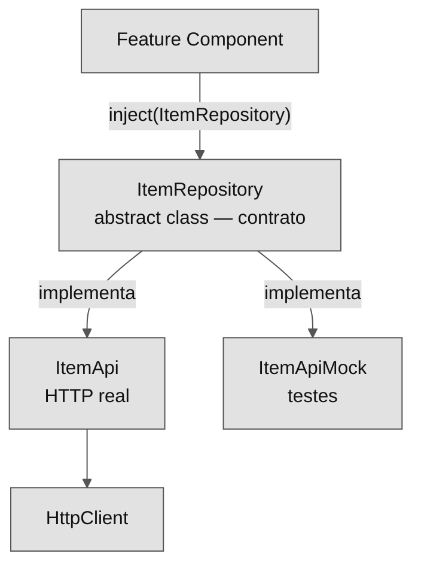

```ts
// domain-a/data-access/items/item-repository.ts  — CONTRATO (público)
import { Observable } from 'rxjs';
import { Item } from './item';

export abstract class ItemRepository {
  abstract findAll(): Observable<Item[]>;
  abstract findById(id: string): Observable<Item>;
  abstract create(data: Partial<Item>): Observable<Item>;
  abstract update(id: string, data: Partial<Item>): Observable<Item>;
  abstract remove(id: string): Observable<void>;
}
```

```ts
// domain-a/data-access/items/item-api.ts  — IMPLEMENTAÇÃO (público)
@Injectable()
export class ItemApi extends ItemRepository {
  private http = inject(HttpClient);
  private url = '/api/items';

  findAll(): Observable<Item[]> {
    return this.http.get<ItemDto[]>(this.url).pipe(map((dtos) => dtos.map(toItem)));
  }
  findById(id: string): Observable<Item> {
    return this.http.get<ItemDto>(`${this.url}/${id}`).pipe(map(toItem));
  }
  create(data: Partial<Item>): Observable<Item> {
    return this.http.post<ItemDto>(this.url, data).pipe(map(toItem));
  }
  update(id: string, data: Partial<Item>): Observable<Item> {
    return this.http.put<ItemDto>(`${this.url}/${id}`, data).pipe(map(toItem));
  }
  remove(id: string): Observable<void> {
    return this.http.delete<void>(`${this.url}/${id}`);
  }
}
```

```ts
// Provendo no DI — na rota da feature
providers: [
  ItemStore,
  { provide: ItemRepository, useClass: ItemApi }, // troca por mock em testes
];
```

### 6.2 `toSignal()` — a ponte obrigatória

A conversão de Observable para Signal acontece uma única vez, no ponto de entrada do componente ou store. O Observable não aparece em nenhum outro lugar da feature.

```ts
// Uso simples: o store disponibiliza signals
export class ItemSearch {
  private store = inject(ItemStore);
  readonly items = this.store.items;
  readonly loading = this.store.loading;
  onItemSelected(item: Item): void {
    this.store.select(item);
  }
}

// Uso com operadores RxJS — conversão imediata na fronteira
export class ItemSearch {
  private repo = inject(ItemRepository);
  query = signal('');
  loading = signal(false);

  items = toSignal(
    toObservable(this.query).pipe(
      debounceTime(300),
      distinctUntilChanged(),
      filter((q) => q.length > 1),
      switchMap((q) => {
        this.loading.set(true);
        return this.repo.findAll().pipe(
          map((items) => items.filter((i) => i.title.includes(q))),
          catchError(() => of([])),
          finalize(() => this.loading.set(false))
        );
      })
    ),
    { initialValue: [] }
  );
}
```

> **Atenção:** `toSignal()` deve ser chamado dentro de um contexto de injeção (campo de classe ou construtor). Chamá-lo dentro de um método causa erro em runtime. Se o Observable puder errar, adicione `catchError` upstream — sem ele, o signal lança no template.

### 6.3 Auth token e headers globais — MUST

Token e headers transversais via interceptor, nunca em cada serviço.

```ts
// shared/utils/auth/auth-interceptor.ts
export const authInterceptor: HttpInterceptorFn = (req, next) => {
  const token = inject(AuthStore).token();
  if (!token) return next(req);
  return next(req.clone({ setHeaders: { Authorization: `Bearer ${token}` } }));
};
```

### 6.4 Tratamento de erros

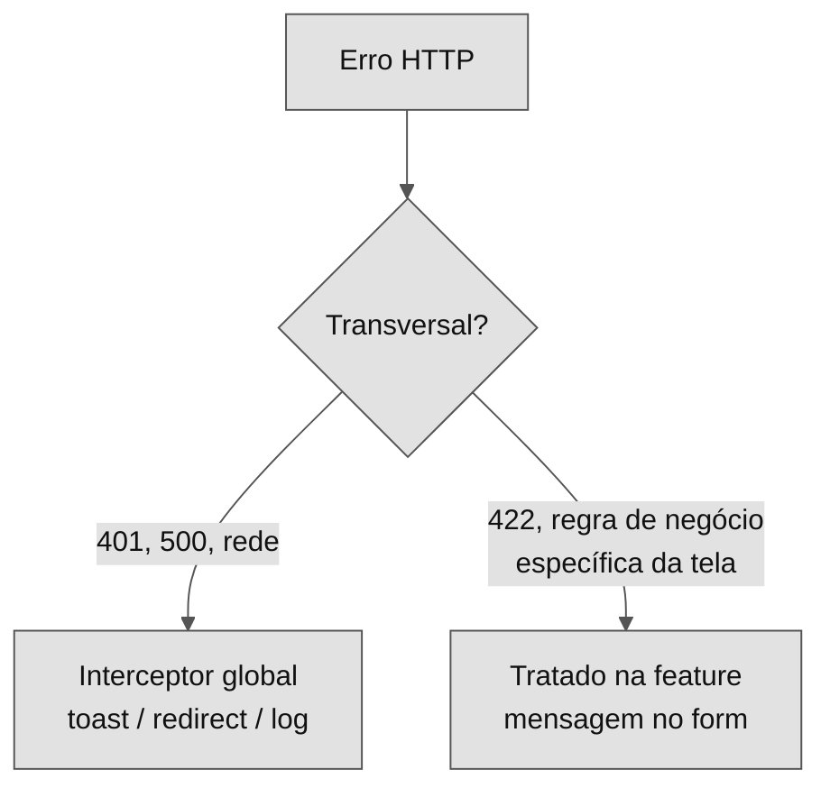

- **Global (interceptor):** 401, 5xx, falha de rede. Centralizado, garante consistência.
- **Local (feature):** 422 de validação, conflito de regra de negócio com feedback específico de tela. Tratado com `catchError` na feature.

### 6.5 Cache e revalidação

- **SHOULD:** cacheie no store da camada `data-access/` dados de leitura frequente e baixa volatilidade.
- Ao mutar (POST/PUT/DELETE), invalide ou atualize o cache explicitamente. Last-write-wins silencioso é fonte de bug.

### 6.6 BFF (Backend for Frontend)

Quando a linguagem do backend não bate com a do frontend, use um BFF — fisicamente no backend, mas logicamente do time frontend.

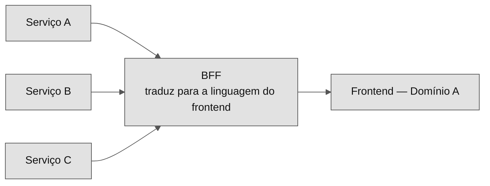

---

## 7. Adapter Pattern para bibliotecas externas

### 7.1 O problema

Bibliotecas de terceiros mudam de API, saem de manutenção ou precisam ser trocadas. Se a lib for usada diretamente em vários módulos, trocá-la exige refatorar todos os pontos de uso. Além disso, a API da lib contamina a semântica do domínio.

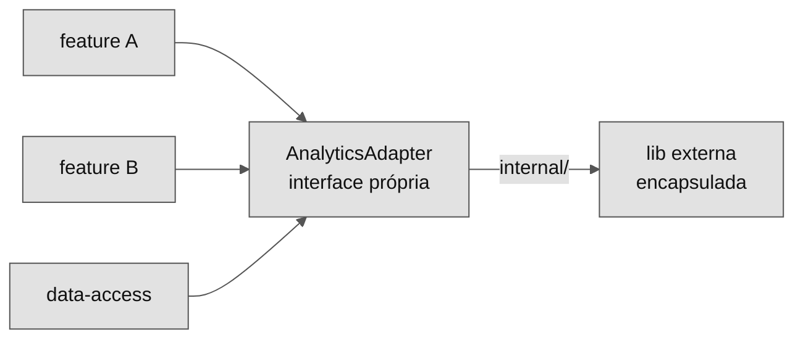

> **MUST:** crie um adapter sempre que uma lib de terceiro afetar mais de um arquivo. O import da lib é proibido fora de `internal/`.

### 7.2 Onde mora o adapter

- Lib usada em múltiplos domínios: `shared/utils/adapters/` ou `shared/utils/<nome>/`.
- Lib usada em um único domínio: `domain-a/utils/<nome>/`.
- A implementação que importa a lib fica em `internal/`. A interface é pública.

```
shared/utils/adapters/
├── analytics-adapter.ts        # interface (pública) — vocabulário do seu domínio
└── internal/
    └── posthog-adapter.ts      # implementação (privada) — toca a lib
```

### 7.3 Como implementar

Passo 1 — Defina a interface na sua linguagem, sem vocabulário da lib:

```ts
// shared/utils/adapters/analytics-adapter.ts
export abstract class AnalyticsAdapter {
  abstract trackEvent(name: string, props?: Record<string, unknown>): void;
  abstract identifyUser(userId: string, traits?: Record<string, unknown>): void;
  abstract trackPageView(path: string): void;
}
```

Passo 2 — Implemente em `internal/` usando a lib:

```ts
// shared/utils/adapters/internal/posthog-adapter.ts
import posthog from 'posthog-js'; // import da lib CONFINADO aqui
import { AnalyticsAdapter } from '../analytics-adapter';

export class PosthogAdapter extends AnalyticsAdapter {
  trackEvent(name: string, props?: Record<string, unknown>): void {
    posthog.capture(name, props);
  }
  identifyUser(userId: string, traits?: Record<string, unknown>): void {
    posthog.identify(userId, traits);
  }
  trackPageView(path: string): void {
    posthog.capture('$pageview', { path });
  }
}
```

Passo 3 — Registre no DI e injete sempre a interface, nunca a implementação:

```ts
// app.config.ts
providers: [{ provide: AnalyticsAdapter, useClass: PosthogAdapter }];

// feature component — nunca importa posthog-js diretamente
export class ItemSearch {
  private analytics = inject(AnalyticsAdapter);
  onItemSelected(item: Item): void {
    this.analytics.trackEvent('item_selected', { itemId: item.id });
  }
}
```

### 7.4 Trocando de lib

Quando a lib precisar ser trocada, apenas uma linha muda:

```ts
// app.config.ts — única alteração
{ provide: AnalyticsAdapter, useClass: MixpanelAdapter }
```

Nenhum componente, nenhum serviço de domínio e nenhum teste de feature precisam saber.

### 7.5 Categorias comuns de adapter

| Categoria                         | Adapter sugerido       | Localização                  |
| --------------------------------- | ---------------------- | ---------------------------- |
| Analytics (PostHog, Mixpanel, GA) | `AnalyticsAdapter`     | `shared/utils/adapters/`     |
| Toast / Notificação               | `NotificationAdapter`  | `shared/utils/notification/` |
| Data e hora (date-fns, Luxon)     | `DateAdapter`          | `shared/utils/date/`         |
| Geração de PDF                    | `PdfAdapter`           | `shared/utils/pdf/`          |
| Gráficos (Chart.js, ECharts)      | `ChartAdapter`         | `shared/utils/chart/`        |
| Storage (localStorage, IndexedDB) | `StorageAdapter`       | `shared/utils/storage/`      |
| Monitoramento de erros (Sentry)   | `ErrorTrackingAdapter` | `shared/utils/monitoring/`   |

### 7.6 Quando não criar um adapter — MAY

- Uso mínimo de uma linha em um único arquivo (ex.: `format(date, 'dd/MM')` do date-fns em um pipe).
- Libs do ecossistema Angular (`@angular/forms`, `@angular/router`) — são extensões do framework, não terceiros voláteis.
- Quando o custo de criar o adapter supera o risco de ter que trocar a lib.

> Heurística: se a lib aparece em mais de um módulo ou se trocá-la seria doloroso, crie o adapter.

---

## 8. Roteamento e navegação

### 8.1 Estrutura de rotas por domínio

As rotas raiz delegam segmentos a arquivos `*.routes.ts` de cada domínio via `loadChildren`. O domínio decide suas sub-rotas; o shell delega apenas um segmento.

### 8.2 Guards, resolvers, `canMatch`

Prefira funções (functional guards) — mais simples, tree-shakable e testáveis que classes.

```ts
// shared/utils/auth/auth-guard.ts
export const authGuard: CanMatchFn = () => {
  const auth = inject(AuthStore);
  const router = inject(Router);
  return auth.isLoggedIn() ? true : router.createUrlTree(['/login']);
};
```

- **`canMatch`** (SHOULD sobre `canActivate`): impede até o lazy load se não autorizado.
- **Resolver:** use com parcimônia. Bloqueia a navegação; prefira navegar e mostrar loading via signal.

### 8.3 Estado de navegação e deep linking

Estado que precisa sobreviver a refresh ou ser compartilhável por link mora na URL (query params), não só em memória. Sincronize URL e signal nas features que precisam de deep linking.

---

## 9. Formulários

### 9.1 Reactive Forms tipados — padrão atual — MUST

Use Reactive Forms tipados para formulários com validação ou lógica.

```ts
form = new FormGroup({
  name: new FormControl('', { nonNullable: true, validators: [Validators.required] }),
  email: new FormControl('', { nonNullable: true, validators: [Validators.email] }),
});
```

### 9.2 Validação e componentes de form reutilizáveis

- Funções de validação reutilizáveis: `utils/` do domínio ou `shared/utils/`.
- Componentes de input customizados (`ControlValueAccessor`): `ui/` do domínio ou `shared/ui/`.

### 9.3 Signal Forms (visão futura — MAY)

Experimental no Angular 21, com estabilização prevista para o 22. Pode ser adotado em áreas não-críticas para ganhar experiência. Manter Reactive Forms como padrão até o time validar a migração.

---

## 10. Performance

### 10.1 OnPush + Signals

Padrão obrigatório (Seção 4.3). É a maior alavanca de performance no Angular zoneless: renderização granular, sem checagens globais.

### 10.2 Deferrable views e lazy loading

- `@defer` para conteúdo abaixo da dobra ou pesado.
- Lazy loading por domínio para enxugar o bundle inicial.

### 10.3 SSR / hydration — MAY

Para apps públicos sensíveis a SEO ou tempo de primeira pintura. Sem esse requisito, SSR adiciona complexidade de build e runtime sem benefício proporcional.

### 10.4 Bundle budgets — MUST

Configure budgets no `angular.json`. Orçamento que não bloqueia o CI é orçamento ignorado.

```jsonc
"budgets": [
  { "type": "initial",           "maximumWarning": "500kb", "maximumError": "1mb" },
  { "type": "anyComponentStyle", "maximumWarning": "4kb" }
]
```

---

## 11. Testes

### 11.1 Estratégia (pirâmide)

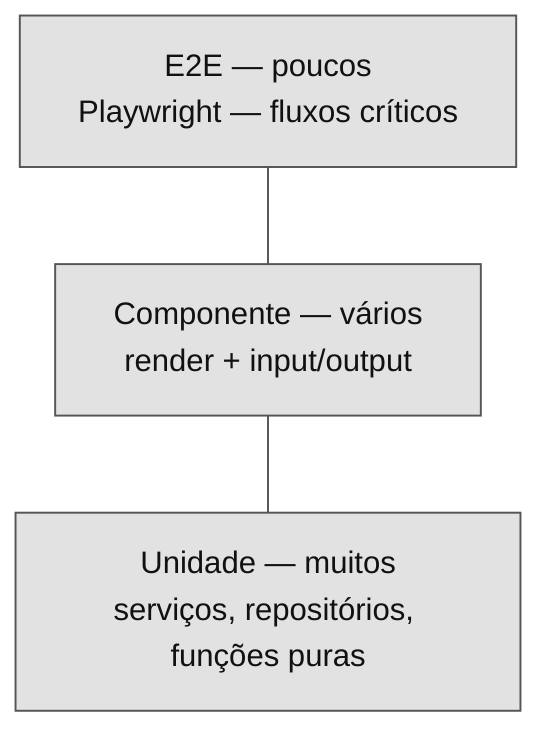

Runner: Vitest (padrão Angular 21+). E2E: Playwright.

### 11.2 Testando com Repository

O principal benefício do Repository é trocar a implementação nos testes sem subir HTTP:

```ts
// domain-a/data-access/items/item-api.mock.ts
export class ItemApiMock extends ItemRepository {
  findAll = vi.fn(() => of([mockItem]));
  findById = vi.fn(() => of(mockItem));
  create = vi.fn(() => of(mockItem));
  update = vi.fn(() => of(mockItem));
  remove = vi.fn(() => of(undefined));
}

// feature/item-search.spec.ts
TestBed.configureTestingModule({
  providers: [{ provide: ItemRepository, useClass: ItemApiMock }],
});
// o componente roda com o mock — sem HTTP real, sem MSW
```

### 11.3 Unidade

Funções de `utils/`, repositório concreto (com `HttpClientTestingModule`) e stores — testáveis sem renderizar componente.

```ts
describe('ItemStore.load', () => {
  it('popula items após load', async () => {
    const store = TestBed.inject(ItemStore);
    await store.load();
    expect(store.items().length).toBeGreaterThan(0);
  });
});
```

### 11.4 Componente

Teste comportamento (dado input, renderiza X; ao clicar, emite Y), não detalhes internos.

```ts
it('emite select ao clicar', async () => {
  await render(ItemCard, { inputs: { title: 'Produto X' }, on: { select: onSelect } });
  await userEvent.click(screen.getByRole('button', { name: /selecionar/i }));
  expect(onSelect).toHaveBeenCalled();
});
```

### 11.5 E2E

**MUST:** apenas fluxos críticos de negócio. E2E é caro e frágil; não replique a pirâmide nele. Cobertura é sinal, não meta.

---

## 12. Padrões de estilo e convenções

### 12.1 Formatação e lint

**MUST:** Prettier (formatação) + ESLint + Sheriff (boundaries). Formatação não é pauta de revisão de código.

### 12.2 Nomenclatura de arquivos e classes — MUST

| Tipo                   | Padrão                     | Exemplo                 |
| ---------------------- | -------------------------- | ----------------------- |
| Componente             | `<nome>.ts`                | `item-search.ts`        |
| Repositório (abstract) | `<entidade>-repository.ts` | `item-repository.ts`    |
| Implementação de API   | `<entidade>-api.ts`        | `item-api.ts`           |
| Store / estado         | `<entidade>-store.ts`      | `item-store.ts`         |
| Guard                  | `<nome>-guard.ts`          | `auth-guard.ts`         |
| Pipe                   | `<nome>-pipe.ts`           | `currency-pipe.ts`      |
| Adapter                | `<nome>-adapter.ts`        | `analytics-adapter.ts`  |
| Modelo de domínio      | `<entidade>.ts`            | `item.ts`               |
| Rotas                  | `<feature>.routes.ts`      | `item-search.routes.ts` |
| Teste                  | `<nome>.spec.ts`           | `item-api.spec.ts`      |
| Bootstrap              | `main.ts`                  | `main.ts` (fixo)        |

Classes e componentes: PascalCase (`ItemSearch`, `ItemApi`). Seletores: prefixo do app em kebab (`app-item-card`). Observables: sufixo `$` (`items$`). Signals: substantivo sem `$` (`items`). Constantes: `UPPER_SNAKE_CASE`.

> O Angular Style Guide 2025 remove sufixos `.component`/`.service`/`.directive`. Serviços são nomeados pelo papel (`*-api`, `*-store`, `*-adapter`). Se o time preferir manter `.component.ts`, configure `--type-separator=.` no CLI. Decida uma vez e seja consistente.

### 12.3 Nomenclatura de métodos — MUST

O nome de um método deve declarar a intenção, não descrever a implementação. Se for preciso ler o corpo do método para entender o que ele faz, o nome está ruim.

Métodos de repositório e API — espelham o verbo HTTP:

| Operação      | Verbo                     | Exemplo                             |
| ------------- | ------------------------- | ----------------------------------- |
| GET (coleção) | `findAll()` / `list*()`   | `findAll()`, `listByStatus(status)` |
| GET (um item) | `findById()` / `get*()`   | `findById(id)`, `getProfile()`      |
| POST          | `create*()`               | `createItem(data)`                  |
| PUT / PATCH   | `update*()`               | `updateItem(id, data)`              |
| DELETE        | `remove*()` / `delete*()` | `removeById(id)`                    |

Métodos de store e estado:

| Intenção             | Verbo                   | Exemplo                                     |
| -------------------- | ----------------------- | ------------------------------------------- |
| Disparar busca async | `load*()`               | `loadItems()`, `loadById(id)`               |
| Ação de negócio      | Nome do evento          | `select(item)`, `approve(id)`, `cancel(id)` |
| Resetar estado       | `reset*()` / `clear*()` | `resetSelection()`, `clearFilters()`        |
| Inicializar          | `initialize()`          | `initialize()`                              |

Propriedades computadas e booleanos:

| Tipo                  | Prefixo     | Exemplo                           |
| --------------------- | ----------- | --------------------------------- |
| Estado atual          | `is*`       | `isLoading`, `isEmpty`, `isValid` |
| Posse                 | `has*`      | `hasError`, `hasItems`            |
| Permissão             | `can*`      | `canEdit`, `canDelete`            |
| Derivado (quantidade) | Substantivo | `count`, `total`, `selectedCount` |

Event handlers em componentes:

```ts
// Correto: descreve o que aconteceu, não o elemento
onItemSelected(item: Item): void { }
onFormSubmitted(): void { }
onFilterChanged(filter: Filter): void { }

// Errado: genérico demais
click(): void { }
submit(): void { }
change(): void { }
```

### 12.4 Organização e tamanho de arquivos

- Um conceito primário por arquivo. Componente, template e estilos no mesmo diretório.
- Arquivo difícil de ler de uma vez é sinal de SRP violado — quebre.

### 12.5 Comentários e documentação por feature

- **SHOULD:** cada feature ou domínio tem um `README.md` curto (o que faz, decisões principais, pontos de extensão).
- Comentários explicam por que, não o quê. TSDoc em APIs públicas de módulos.

---

## 13. Enforcement e tooling

### 13.1 Sheriff: tags e depRules

```bash
npm i -D @softarc/sheriff-core @softarc/eslint-plugin-sheriff
```

```ts
// sheriff.config.ts
import { sameTag, SheriffConfig } from '@softarc/sheriff-core';

export const config: SheriffConfig = {
  enableBarrelLess: true,
  modules: {
    'src/app/domains/<domain>': {
      'features/<name>': ['domain:<domain>', 'type:feature'],
      'ui/<name>': ['domain:<domain>', 'type:ui'],
      'data-access/<name>': ['domain:<domain>', 'type:data'],
      'utils/<name>': ['domain:<domain>', 'type:util'],
    },
  },
  depRules: {
    root: '*',
    'domain:*': [sameTag, 'domain:shared'],
    'type:feature': ['type:ui', 'type:data', 'type:util'],
    'type:ui': ['type:data', 'type:util'],
    'type:data': ['type:util'],
    'type:util': [],
  },
};
```

### 13.2 Detective: visualização e análise forense

```bash
npm i -D @softarc/detective && npx detective
```

- **Grafo de dependências** — a espessura das arestas indica o volume de imports.
- **Change Coupling** — arquivos que mudam juntos no histórico Git revelam acoplamento lógico não visível no grafo.
- **Hotspots** — alta frequência de mudança cruzada com complexidade indica candidato a refatoração.
- **Team Alignment** — verifica se os times estão alinhados com os domínios (Lei de Conway).

> Essas análises são base de discussão, não metas numéricas. Apontam onde olhar; a decisão é do time.

### 13.3 Gates de CI — MUST

```bash
npm run lint    # ESLint + Sheriff
npm run test    # Vitest
npm run build   # com budgets
```

---

## 14. Apêndices

### 14.1 Checklist — criar um novo domínio

- [ ] O nome é um conceito de negócio, não técnico?
- [ ] As fronteiras foram discutidas com o time?
- [ ] A pasta `src/app/domains/<domain>/` foi criada com as camadas necessárias (`features/`, `ui/`, `data-access/`, `utils/`)?
- [ ] As tags do Sheriff foram configuradas?
- [ ] A rota raiz delega via `loadChildren`?

### 14.2 Checklist — criar uma nova feature

- [ ] Classifiquei a camada e o domínio?
- [ ] A feature injeta `ItemRepository`, não `ItemApi` diretamente?
- [ ] O Observable está confinado à camada `data-access/`? `toSignal()` na fronteira?
- [ ] O componente é standalone + OnPush?
- [ ] O lazy loading está configurado na rota?
- [ ] Sem `NgModule`, sem barrel (`index.ts`)?
- [ ] O teste co-localizado foi criado?
- [ ] `npm run lint` passa?

### 14.3 Checklist — adotar nova lib externa

- [ ] Criei um adapter em `shared/utils/<nome>/` ou `<domain>/utils/<nome>/`?
- [ ] A implementação que importa a lib está em `internal/`?
- [ ] A interface usa vocabulário do meu domínio, não da lib?
- [ ] O código de feature injeta a interface, não a implementação?
- [ ] O `app.config.ts` registra `{ provide: XAdapter, useClass: XAdapterImpl }`?
- [ ] O teste usa um mock do adapter, não da lib?

### 14.4 Glossário

- **Vertical / Domínio** — fatia de negócio (bounded context).
- **Camada** — separação técnica: `features/`, `ui/`, `data-access/`, `utils/`.
- **Bounded Context** — fronteira dentro da qual um modelo e uma linguagem são consistentes (DDD).
- **Repository** — abstract class que define o contrato de acesso a dados, desacoplando a feature da implementação.
- **Adapter** — wrapper que encapsula uma lib externa atrás de uma interface própria.
- **Smart / Dumb Component** — container (com lógica, acessa store) vs. apresentacional (só input/output).
- **toSignal()** — ponte que converte um Observable da camada `data-access/` em Signal consumível pelo componente.
- **Change Coupling** — arquivos que mudam juntos no histórico Git, indicando acoplamento lógico.
- **Hotspot** — arquivo com alta frequência de mudança cruzada com complexidade.
- **BFF** — Backend for Frontend; traduz contextos do backend para a linguagem de uma vertical de frontend.

### 14.5 Anti-padrões

- **`shared/` inchado** — a maioria do código vira compartilhado, recriando acoplamento global.
- **`utils/` genérico (`utils.ts`)** — vira lixeira sem coesão; nomeie pelo conteúdo (`date-formatting.ts`).
- **Import entre domínios** — burla os boundaries; use `shared/` ou remodele os domínios.
- **`HttpClient` em `features/`** — vaza acesso a dados para fora da camada `data-access/`.
- **Observable no template** — use `toSignal()` na fronteira; nunca `async` pipe misturado com signals.
- **Abstract class usada como implementação** — o repositório é o contrato; a implementação (`*-api.ts`) é quem herda.
- **Lib externa importada fora de `internal/`** — viola o adapter pattern.
- **Promoção especulativa** — extrair "para reusar" antes de existir um segundo consumidor.
- **`effect` para derivar estado** — use `computed`.
- **Barrels (`index.ts`)** — quebram tree-shaking e lazy loading.
- **Mutação de estado no lugar** — no zoneless, pode não atualizar a tela.

---

### Referências

- Angular Style Guide (2025) — https://angular.dev/style-guide
- _Enterprise Angular: Architectures with Moduliths and Micro Frontends_, Manfred Steyer (7ª ed.)
- _Modern Angular: Architecture, Concepts, Implementation_, Manfred Steyer — https://angular-book.com
- Sheriff — https://github.com/softarc-consulting/sheriff
- Detective — https://github.com/angular-architects/detective
