# Shell — Como funciona

O Shell é a aplicação Angular 21+ que fica sempre carregada no browser. Ele não tem funcionalidade de negócio — ele é a estrutura que sustenta tudo. É ele que decide o que carregar, quando carregar e onde renderizar cada Micro Frontend.

O Shell e todos os MFEs novos são escritos em **Angular moderno** — standalone components, Signals como reatividade primária, zoneless por padrão.

---

## Visão geral

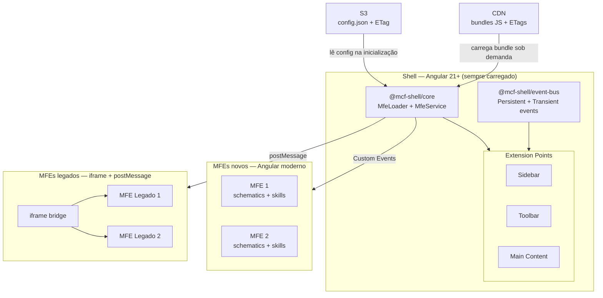

O Shell não sabe com antecedência quais MFEs existem. Ele lê a configuração no S3, monta a estrutura de rotas dinamicamente e carrega cada bundle só quando o usuário navega para aquela área.

---

## Por que o Shell é Angular moderno?

O Shell é a base de tudo — é onde vivem as libs compartilhadas, o event bus e os extension points. Usar Angular 21+ aqui não é só uma escolha técnica: é o que garante que os padrões novos funcionem corretamente.

- Signals e zoneless só entregam o resultado esperado com Angular 21+
- Os schematics e skills que os MFEs vão usar dependem da estrutura do Shell estar no padrão novo
- MFEs legados continuam funcionando via iframe — não há obrigação de reescrita imediata

---

## Schematics e Skills dentro de cada MFE

Cada MFE novo vem com dois recursos que aceleram o desenvolvimento e garantem consistência.

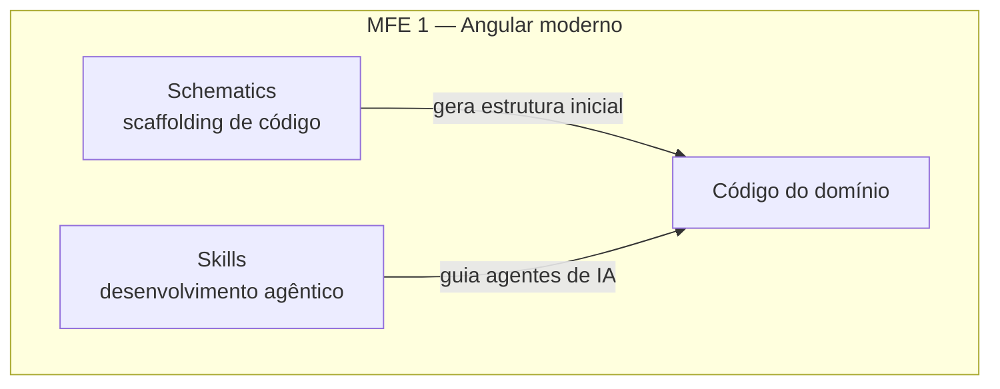

**Schematics** são geradores de código via Angular CLI. Ao criar um novo domínio, feature ou repositório dentro do MFE, o dev roda um comando e a estrutura correta já é gerada — pastas, arquivos, imports e padrões no lugar certo. Não há decisão manual sobre onde cada coisa mora.

**Skills** são instruções estruturadas para agentes de IA — como o Claude — entenderem os padrões do projeto e gerarem código aderente a eles. Em vez de o agente inventar uma estrutura, ele lê a skill do MFE e sabe exatamente como o código deve ser escrito naquele contexto.

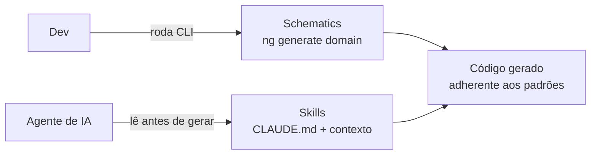

O resultado é que tanto um dev rodando um comando quanto um agente gerando código chegam no mesmo lugar — a estrutura correta do projeto.

---

## Por que o carregamento é dinâmico?

Em um sistema com múltiplos times entregando MFEs independentes, não é possível — nem desejável — que o Shell precise ser redeployado toda vez que um MFE muda. O carregamento dinâmico resolve isso.

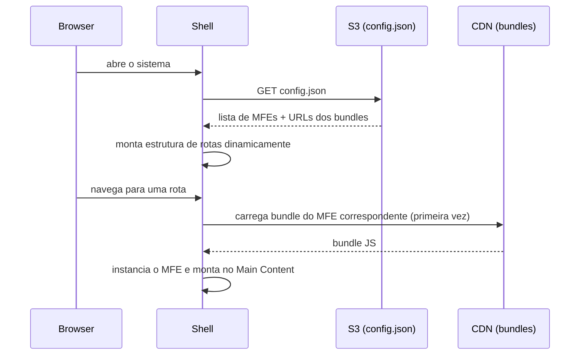

**O que isso garante na prática:**

- Um time faz deploy do MFE 1 sem avisar ninguém
- Na próxima navegação para aquela rota, o Shell já carrega a versão nova
- O Shell não foi tocado, não foi redeployado, não foi testado novamente

---

## Por que duas libs separadas — `@mcf-shell/core` e `@mcf-shell/event-bus`?

São responsabilidades diferentes com motivos de mudança diferentes.

| Lib                    | Responsabilidade                                         | Muda quando                                               |
| ---------------------- | -------------------------------------------------------- | --------------------------------------------------------- |
| `@mcf-shell/core`      | Carregar MFEs, gerenciar extension points, bootstrapping | A mecânica de carregamento ou os pontos de extensão mudam |
| `@mcf-shell/event-bus` | Comunicação entre MFEs via eventos                       | O contrato de comunicação entre MFEs muda                 |

Se fossem uma lib só, uma mudança no carregamento de bundle forçaria todos os MFEs a atualizar a dependência — mesmo os que nunca usam aquela parte. Separadas, cada MFE declara só o que realmente precisa.

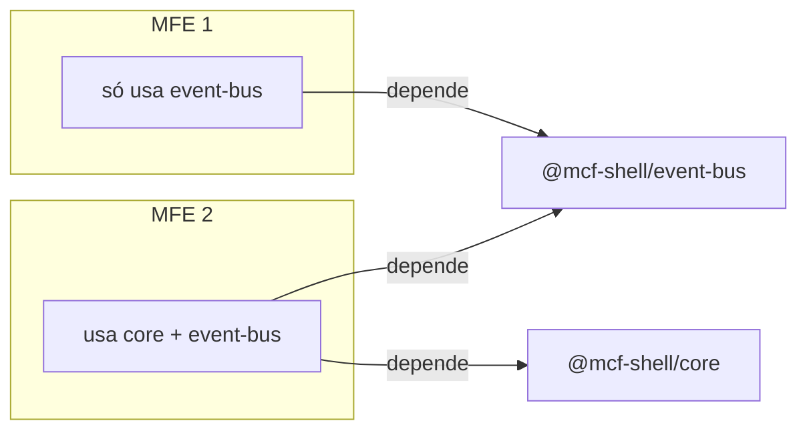

---

## Extension Points — Sidebar, Toolbar e Main Content

O Shell expõe três pontos fixos onde os MFEs podem se registrar. Eles não são páginas — são slots. Cada MFE decide o que colocar em cada slot ao ser carregado.

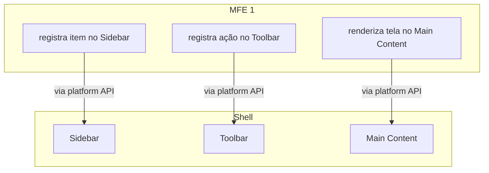

O Shell não conhece o MFE 1 em tempo de compilação. O MFE, ao ser carregado, usa a platform API do `@mcf-shell/core` para se registrar nos slots que precisa.

---

## Event Bus — como os MFEs se comunicam sem se conhecer

MFEs não importam código um do outro. Qualquer comunicação entre eles passa pelo event bus. Existem dois tipos de evento com comportamentos diferentes.

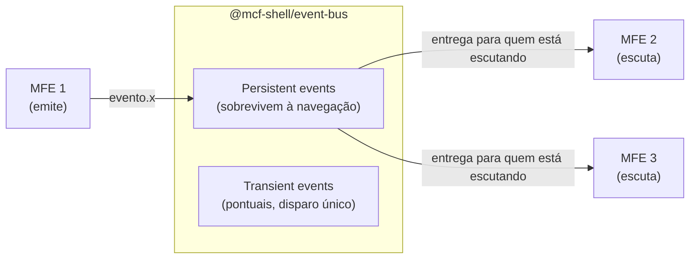

**Persistent events** — usados para estado que precisa sobreviver à navegação. Se o MFE 1 emitir um evento e o MFE 2 ainda não estiver carregado, o evento fica guardado e é entregue quando o MFE 2 for carregado.

**Transient events** — usados para ações pontuais. O evento existe só no momento do disparo. Se ninguém estiver escutando, ele é descartado.

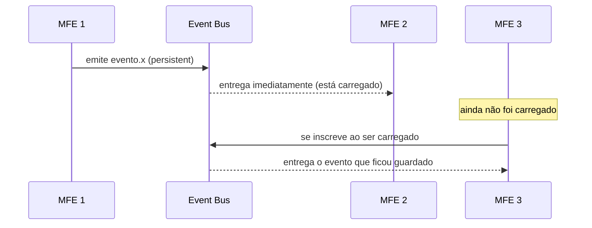

---

## Comunicação com MFEs legados — iframe e postMessage

MFEs legados não conseguem usar o event bus diretamente. A solução é o iframe com uma bridge de postMessage. O Shell faz a tradução.

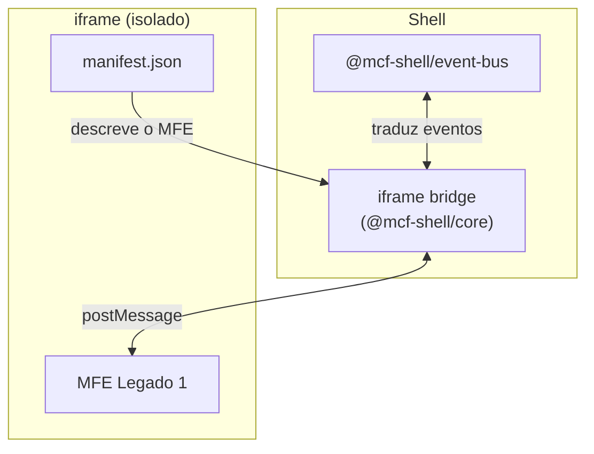

**O que o MFE legado consegue fazer via postMessage:**

- Emitir eventos para o event bus do Shell
- Receber eventos do event bus do Shell
- Solicitar navegação para outra rota
- Registrar itens no Sidebar e Toolbar

O MFE legado não sabe que está dentro de um iframe ou que existe um Shell. Ele se comunica com a bridge como se fosse qualquer outra mensagem. A bridge traduz para o event bus.

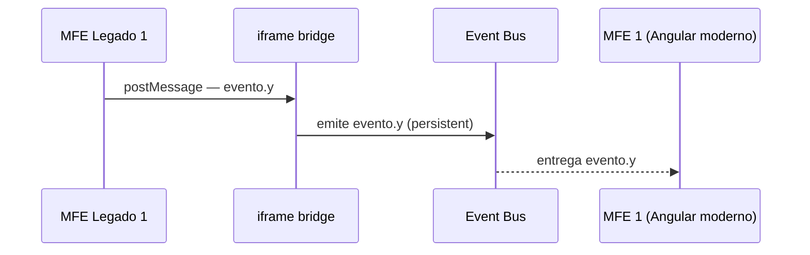

---

## Cache inteligente com ETag

O Shell usa ETag tanto para o `config.json` quanto para os bundles dos MFEs. Isso garante que o browser só baixa o que realmente mudou.

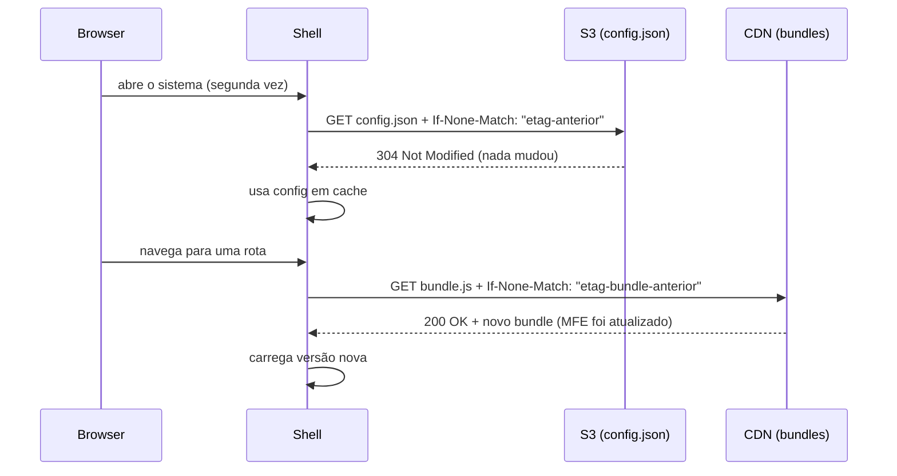

O usuário abre o sistema pela segunda vez e quase nada é baixado da rede. Só os bundles que foram atualizados desde a última visita são transferidos.

---

## Fluxo completo — do S3 ao MFE renderizado

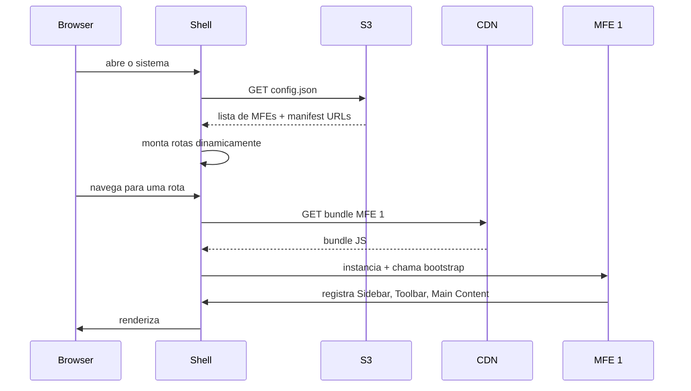

---

## O que o Shell nunca faz

- Não tem regra de negócio
- Não conhece os MFEs em tempo de compilação
- Não é redeployado quando um MFE muda
- Não comunica MFEs entre si diretamente — essa responsabilidade é do event bus
